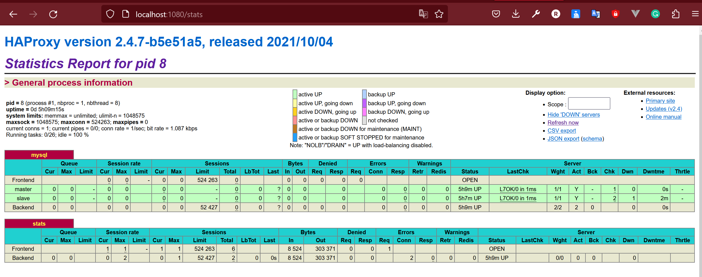

# MySQL - 记一次 Docker 部署主从架构


首先先上 Docker Compose 文件：


```yaml
version: '3.9'

# 定义网络
networks:
  default:
    driver: bridge

services:

  # 定义主数据库
  db_master:
    image: mysql:8.0.31
    container_name: db_master
    restart: always
    networks:
      - default
    environment:
      MYSQL_ROOT_PASSWORD: "linnzh"
      MYSQL_DATABASE: "linnzh"
      MYSQL_REPLICATION_USER: replica
      MYSQL_REPLICATION_PASSWORD: replica_password
      MYSQL_INITDB_SKIP_TZINFO: "yes"
    working_dir: /opt/www
    expose:
      - 3306
#    command: "--server-id=1 --log-bin=binlog --binlog-do-db=linnzh --default_authentication_plugin=mysql_native_password"
    volumes:
      - ./conf/mysql_master.conf:/etc/mysql/conf.d/my.cnf
      - ./db_master:/var/lib/mysql
      - .:/opt/www

  # 定义从数据库
  db_slave:
    image: mysql:8.0.31
    container_name: db_slave
    restart: always
    networks:
      - default
    environment:
      MYSQL_ROOT_PASSWORD: "linnzh"
      MYSQL_DATABASE: "linnzh"
      MYSQL_MASTER_HOST: db_master
      MYSQL_MASTER_PORT: 3306
      MYSQL_MASTER_USER: replica
      MYSQL_MASTER_PASSWORD: replica_password
      MYSQL_INITDB_SKIP_TZINFO: "yes"
    working_dir: /opt/www
    expose:
      - 3306
#    command: "--server-id=2 --log-bin=binlog --binlog-do-db=linnzh --skip-slave-start --default_authentication_plugin=mysql_native_password"
    volumes:
      - ./conf/mysql_slave.conf:/etc/mysql/conf.d/my.cnf
      - ./db_slave:/var/lib/mysql
      - .:/opt/www

  # 定义 HAProxy 负载均衡器
  # 当客户端发起连接请求时，HAProxy会根据配置规则将请求路由到主节点或从节点上，实现负载均衡和高可用性。
  # 如果主节点发生故障或不可用，HAProxy会自动将客户端请求路由到从节点上，确保服务的连续性和可用性。
  haproxy:
    image: haproxy:lts-alpine
    container_name: haproxy
    networks:
      - default
    depends_on:
      - db_master
      - db_slave
    ports:
      - "3306:3306"
      - "1080:1080"
    volumes:
      - ./haproxy/haproxy.cfg:/usr/local/etc/haproxy/haproxy.cfg
```


## 概述


以上 Docker Compose 文件配备了两个 MySQL 服务：`db_master`和`db_slave`。在 MySQL 主从架构中，master 将 write 操作的数据记录到二进制日志中，slave 数据库定期读取二进制日志并应用到自己的数据库中，还可以通过多个线程从 master 中复制数据，从而提高数据的复制速度。


MySQL 的读写分离需要一个**负载均衡器**（Load Balance）来分配请求到不同的数据库节点。负载均衡器可以根据应用程序的负载情况和数据库节点的负载情况来决定将请求发到哪个节点，还可以检测数据库节点的可用性，当一个节点不可用时，自动将请求发送到其他可用的节点。

MySQL 可以使用 **HAProxy** 来配置监听端口、转发规则、读写分离规则等。


## MySQL


### 配置


1. 在主从主机上部署好 MySQL，并**在主库上启用二进制日志**，注意主从 server-id 必须不一样，主库的配置文件类似如下：

   ```ini
   # mysql_master.conf
   # master 数据库相关配置
   [mysqld]
   # required!!!
   
   # 主从 server-id 必须不一样
   server-id=1
   # 要复制的数据库，多个数据库可用英文逗号隔开
   binlog-do-db=linnzh
   
   # -----------------
   # 剩下的是一些默认配置
   # -----------------
   
   # 建议主从配置一样的名字
   log-bin=mysql-bin
   binlog-format=row
   innodb_flush_log_at_trx_commit=1
   sync_binlog=1
   #default_authentication_plugin=mysql_native_password
   authentication_policy=mysql_native_password
   lower_case_table_names=2
   
   host_cache_size=0
   lower_case_table_names=2
   performance_schema=ON;
   
   #skip-host-cache
   #skip-name-resolve
   #datadir=/var/lib/mysql
   #socket=/var/run/mysqld/mysqld.sock
   #secure-file-priv=/var/lib/mysql-files
   #user=mysql
   
   [mysql]
   default-character-set=utf8mb4
   
   [client]
   default-character-set=utf8mb4
   ```

2. 从库的配置文件如下：

   ```ini
   # mysql_slave.conf
   # slave 数据库相关配置
   [mysqld]
   # required!!!
   
   # 主从 server-id 必须不一样
   server-id=2
   # 要复制的数据库，多个数据库可用英文逗号隔开
   binlog-do-db=linnzh
   
   # -----------------
   # 剩下的是一些默认配置
   # -----------------
   
   # 建议主从配置一样的名字
   log-bin=mysql-bin
   
   # 设置了read_only=1之后，将只有 SUPER 权限的用户才可以修改数据
   read_only = 1
   
   skip_replica_start
   
   host_cache_size=0
   lower_case_table_names=2
   
   [mysql]
   default-character-set=utf8mb4
   
   [client]
   default-character-set=utf8mb4
   ```

3. 在 master 数据库添加 slave 用于复制的用户并分配权限：

   ```sql
   # 1. 创建用户
   CREATE USER 'replica' IDENTIFIED WITH mysql_native_password BY 'replica_password';
   # 替换为 Docker compose 的环境变量即：
   CREATE USER '${MYSQL_REPLICATION_USER}' IDENTIFIED WITH mysql_native_password BY '${MYSQL_REPLICATION_PASSWORD}';
   
   # 2. 分配权限
   GRANT REPLICATION slave, REPLICATION client ON *.* to 'replica';
   # 替换为 Docker compose 的环境变量即：
   GRANT REPLICATION SLAVE,REPLICATION CLIENT ON *.* TO '${MYSQL_REPLICATION_USER}';
   ```

4. slave 连接 master：

   ```sql
   # 1. slave 连接至 master
   CHANGE MASTER TO
       MASTER_HOST='127.0.0.1',
       MASTER_PORT=3306,
       MASTER_USER='replica',
       MASTER_PASSWORD='replica_password';
   # 替换为 Docker compose 的环境变量即：
   CHANGE MASTER TO MASTER_HOST='${MYSQL_MASTER_HOST}', 
   	MASTER_PORT=${MYSQL_MASTER_PORT}, 
   	MASTER_USER='${MYSQL_MASTER_USER}', 
   	MASTER_PASSWORD='${MYSQL_MASTER_PASSWORD}';
   
   # 2. 启动 slave（开始复制，这里直接在 start slave 后追加了连接用户的信息，这样就不会保存至数据库内，更加安全
   START SLAVE USER='replica' PASSWORD='replica_password';
   # 替换为 Docker compose 的环境变量即：
   START SLAVE USER='${MYSQL_MASTER_USER}' PASSWORD='${MYSQL_MASTER_PASSWORD}';
   ```

5. slave 停止复制：

   ```sql
   # 查看连接状态：
   SHOW SLAVE STATUS \G;
   
   # 停止复制
   STOP SLAVE
   ```


### 验证


验证过程可以通过在 master 中创建一个表并添加数据，之后在 slave 中查看该表是否存在、该条数据是否存在。


Master 操作：

```sql
# On master

# swith database
USE linnzh;

# create table
CREATE TABLE test (id INT PRIMARY KEY AUTO_INCREMENT, value VARCHAR(50));

# insert rows
INSERT INTO test (value) VALUES ('value1'), ('value2');
```

Slave 操作：

```sql
# On slave

# swith database
USE linnzh;

# check table
SELECT * FROM test;
```


### 踩坑


> 大部分坑都是因为修改 docker-compose.yml 文件后，没有及时删除数据库文件（使用了之前的缓存）导致的。


1. 在配置 master 和 slave 的时候，出现过**明明配置文件是不同的 server-id，但启动 slave 时报错说 server id 不允许相同**。

   之后忘记怎么解决的了，应该是缓存的问题。后续删掉容器映射的数据库文件后，重启，问题消失。

   > 或者在容器启动时加上 server-id 的配置，即：
   >
   > ```yaml
   > command: "--server-id=1"
   > ```

2. 出现过主从复制失败的情况，提示说 MySQL 用户`replica`已在 slave 中存在。

   在 slave 删除该用户后，错误还是存在；

   使用`stop slave;reset slave;change master...;start slave;`重置信息后，仍然报错；

   无奈，还是删除了数据库文件，重启，问题消失。


## HAProxy


负载均衡器 HAProxy 主要问题在于配置文件如何配置，参考如下：


```ini
# haproxy/haproxy.cfg
global
    log 127.0.0.1   local0 notice
    group haproxy

defaults
    log global
    mode tcp
    option tcplog
    retries 3
    timeout connect 5s
    timeout client 30s
    timeout server 30s

# 监听 MySQL
listen mysql
	# 监听 MySQL 服务的对外端口
    bind *:3306
    mode tcp
    # option mysql-check 选项
    # 使用名为 haproxy 的 MySQL 用户去监听 MySQL
    option mysql-check user haproxy

    balance roundrobin
    
    # 配置监听的 MySQL 节点
    # server 节点名称 节点Host:节点端口 
    server master db_master:3306 check
    server slave db_slave:3306 check

# 监听统计
listen stats
	# 监听页面的端口号
    bind *:1080
    mode http
    stats enable
    stats uri /stats
    # 配置认证的登录名和密码
    stats auth admin:password
```

这里用到了一个`stats`页面，用来查看监听的节点信息。


### 前置准备


从上述配置可以看出，HAProxy 监听 MySQL 需要一个特殊的用户，这里命名为`haproxy`：


```sql
# On master

# 创建 haproxy 用户
CREATE USER 'haproxy' IDENTIFIED WITH mysql_native_password BY '' WITH MAX_QUERIES_PER_HOUR 1 MAX_UPDATES_PER_HOUR 0;
```


这里有一个坑：**要求该用户必须是空密码**。

在前面的 `haproxy/haproxy.cfg`中，配置了很多次用户名+密码的方式，都无法连接到 MySQL，后来在 StackOverflow 看到答案，必须是空密码才可以（但是在 haproxy 的官方文档没有看到相关说明）。


### 启动


然后启动 HAProxy 服务，访问页面<http://localhost:1080/stats>，然后输入配置的认证用户名 admin 和密码 password，就可以看到监听的 MySQL 服务：




具体数据含义就不深究了，启动就OK。

