# 摘抄 - 遗留系统现代化实战

> 该课程来源于[极客时间](https://time.geekbang.org/)的[遗留系统现代化实战](https://time.geekbang.org/column/intro/100111101)。

## 开篇词｜你现在所写的每一行代码，都是未来的遗留系统

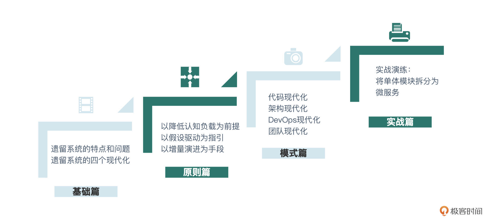

> **遗留系统现代化**三原则：
>
> **以降低认知负载为前提、以假设驱动为指引、以增量演进为手段**。

1. 很多系统的改造都只针对局部问题，缺乏全局的认知和系统的视角。
   1. 比如重构代码是为了什么？只是为了提升可读性吗？拆分模块是为了什么？只是为了架构整洁吗？
   2. 为什么耗时一年的改造上线之后因为 bug 太多而不得不被叫停，最后不了了之？
2. 什么样的系统算遗留系统？
   1. 代码质量一言难尽，改个需求或做维护经常加班，让你恨不得推翻重写；
   2. 架构混乱，模块之间职责不明，一个需求需要修改四五个服务；
   3. CI/CD 运转不畅，经常莫名其妙地挂掉，
   4. 每次升级、上线都一拖再拖；
   5. 团队结构不稳定，人员变动频繁；
   6. 大家都在拼命开发新需求，没人关心技术债；
   7. ……
3. `软件系统本身就是一个不断熵增的过程，代码逐渐从有序变得无序。如果没有测试的严防死守，熵增的过程就会慢慢加快，代码很快就会变得混乱不堪。`
4. 遗留代码通常都是无法直接写测试的，所以要先进行可测试化重构，才能补上测试。

## 01｜遗留系统之殇：为什么要对遗留系统进行现代化？

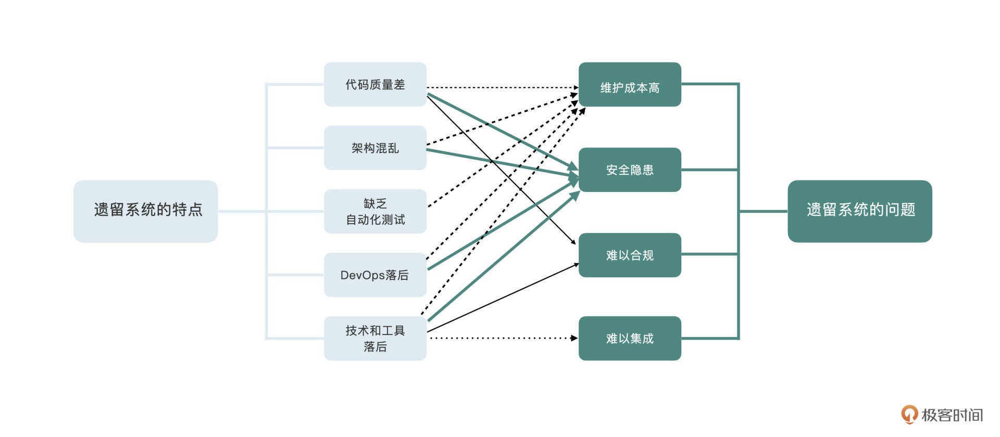

1. 时间长短并不是衡量遗留系统的标准。**代码质量差、架构混乱、没有测试、纯手工的 DevOps（或运维）、老旧的技术和工具，才是遗留系统的真正特点**。

   1. 要有测试！！！
   2. 使用自动化运维
   3. 及时更新稳定的技术栈和工具（**代码和架构的落后还会导致系统在合规和安全方面的问题**）

2. **一个软件架构的作用，是要解决多个业务模块之间的协作问题**。但如果架构混乱，**`多个模块之间往复调用，数据也是随意访问，模块之间的边界就会变得模糊，数据所有权也会变得含糊`**。

   1. 在自己目前所有的代码里都存在这个问题，有机会的话希望可以进行重构：分割业务模块，强调边界、数据所有权。

3. **修复一个 Bug 的过程可以是这样的**：

   1. 先在本地复现 Bug，找到产生这个 Bug 的业务场景；
   2. 为这个业务场景添加一个自动化测试并运行，发现这个测试是失败的；
   3. 修改代码，让这个新增的测试通过；
   4. 运行所有的测试，确保所有的测试通过。

   这恰好和 TDD 项目实战课程里讲的**红/绿/重构**流程一致！

## 02 | 遗留系统现代化：遗留系统的四化建设

> 代码现代化的首要任务，就是对遗留系统的代码进行安全的可测试化重构。

1. 在正常情况下，重构应该是在充分的自动化测试的保护下进行的。但对于没有测试的代码，我们只能“硬着头皮”去做一些相对来说比较安全的重构，将代码重构成可以写测试的程度，然后再补上大量的测试，进而在有充分测试覆盖的情况下，进行更广泛更深入的重构。

2. 在单元测试中，我们是不可能直接访问真实的数据库的。

   1. 因此要想测试这样的方法，只能先对它进行可测试化重构，也就是先将它重构为可测试的代码。

3. 遗留系统的架构现代化，可以分成“**改造老城区**”和“**建设新城区**”两类模式。

   1. **改造老城区模式是指对遗留系统内部的模块进行治理、让模块内部结构合理、模块之间职责清晰的一系列模式**。
   2. 前端方面包括单页应用注入、微前端等。
   3. 后端包括抽象分支、扩张与收缩等，数据库端包括变更数据所有权、将数据库作为契约等。

   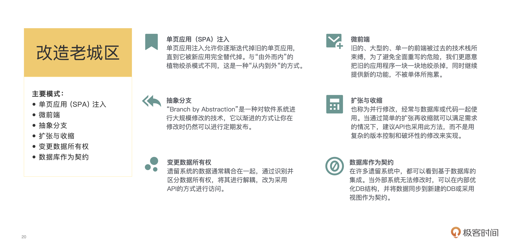

4. 建设新城区模式是指将遗留系统内部的某个模块拆分到外面，或将新需求实现在遗留系统外部的一系列模式。

   1. 包括绞杀植物、冒泡上下文等。
   2. 为了对新建立的新城区予以各种支持，老城区还可以**通过提供 API、变动数据捕获、事件拦截等各种模式，与新城区进行集成**。

   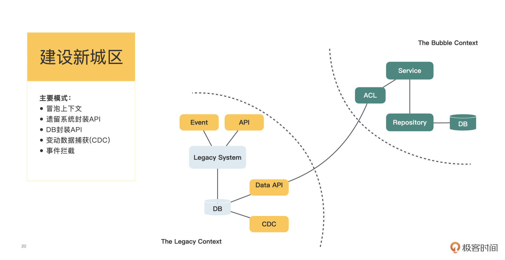

5. 要从头开始搭建一个 DevOps 平台，包括**代码、构建、测试、打包、发布、配置、监控**等多个方面。

   1. 项目可以先从 CI/CD 开始，哪怕是一个自动化构建
   2. 对于重构，可以先有目的地取尝试小范围测试+重构，体验这个过程，然后慢慢习惯

## 03｜以降低认知负载为前提：为什么遗留系统这么难搞？

> **我们要完成一项工作，就要在内在认知负载一定的前提下，尽量减少外在认知负载，增加相关认知负载。**
>
> 以软件开发为例，要完成这项工作，就要在掌握开发技能的前提下，尽量简化与开发需求本身无关的细节，而去了解尽可能多的业务知识。

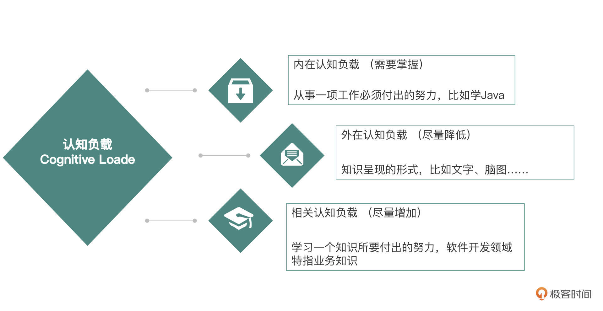

1. 认知负载的三个分类：
   1. **内在认知负载**是指从事一项工作必须付出的努力，比如学习 Java 知识、前端知识等；
   2. **外在认知负载**是指知识呈现的形式，代码越糟糕、越难读，外在认知负载越高；
   3. **相关认知负载**是指人们要学习一个知识所要付出的努力，在软件开发领域就特指业务知识。
2. 遗留系统最大的认知负载其实是无处可寻的业务知识。
   1. 遗留系统在构建的时候，往往会有成百上千页的需求、设计文档，这些的确能准确描述当时的系统状态。然而随着时间的更迭、需求的演化，当前的系统已经和构建时不可同日而语，且不同阶段的文档往往无法很好地保留下来，这就造成了业务知识的缺失。
   2. 如果系统中包含自动化测试，尤其是那种描述一个端到端业务的自动化测试，某种意义上是可以被看作有效文档的。
   3. 要想捋清一个遗留系统的业务，唯一有效的方式就是“扒代码”。但这种方法同时又是非常低效的，因为遗留系统的代码质量往往惨不忍睹，想靠人工的方式来梳理代码理清业务，是几乎不可能完成的任务。
3. 遗留系统的第二大认知负载，是同样难以获取的系统知识。
   1. 这里的系统知识是指系统的具体实现细节，包括模块的划分、架构的取舍，以及每一个技术决策的原因。这些知识也同样很难有文档可以一窥究竟，更遗憾的是，连代码都无法体现出每一个细节。
4. 人们在遗留系统上工作的时候，所付出的脑力劳动比正常系统要多得多，因此只要能大致测试通过，就会凑合着上线，而没有精力去偿还欠下的债务、改善外在认知负载。
   1. 如此恶性循环，导致遗留系统的外在认知负载越来越高，修改起来越来越难。
5. 一些可行的**降低认知负载**的操作：
   1. 对代码进行重构、改善代码的可读性，可以降低阅读代码的难度，实际上就是降低代码的认知负载；
   2. 对单体架构进行拆分，分解成多个小的、更加内聚的微服务，每个服务可以独立部署和演进，实际上就是在降低业务和系统的认知负载；
   3. 优化持续集成流水线，让开发人员提交代码之后就不必随时关注后续的步骤，轻装上阵；
   4. 对团队结构进行优化，让每个团队只关注少量大小适中的业务模块，以降低认知负载。

## 04 | 如何降低认知负载：活的文档能救命

> 本章推荐书籍：
>
> - 《实例化需求》——Gojko Adzic
> - 《活文档——与代码共同演进》

#### 如何用活文档挖掘业务知识？

1. **为遗留代码添加注解**

   阅读代码时，我们是以线性的方式逐行阅读的，这样的信息进入大脑后，就会处理成上面这样的树状信息，方便理解和记忆。但当代码过于复杂的时候，这个处理过程就会需要更多的脑力劳动，导致过高的认知负载。

   可以通过在代码中加入活文档的方式，来降低认知负载——阅读某一功能时，把代码转换为**脑图**，更直观地理解代码逻辑。

   据此，可以始终更新一份这样的**在线脑图**作为活文档，业务分析师、开发人员、测试人员都可以围绕这样一份文档来讨论需求、设计测试用例。

2. 用**实例化需求**的方式编写测试

   1. 所谓实例化需求，实际上指的是**以现实中的例子来描述需求，而不是抽象的描述**——听起来像 User Story，而不是需求文档里的抽象描述。
   2. 在开发时，可以**将这种需求转换为测试**，这种以实例化方式描述的测试，也是一种活文档。它们不但很好地展示了业务知识，而且是随代码更新的。

## 05 | 以假设驱动为指引：如何评价遗留系统的现代化成果？

> **技术要为业务服务**。
>
> 业务不需要的话，技术升级没有任何意义。
>
> 做好了，业务方面也感知不到；
>
> 做不好，很有可能导致项目失败，可谓费力不讨好。

1. 如果一个遗留系统平时用的人不多，需求也不多，一两个开发人员完全能够应付得来，这种情况还需要技术的更新换代吗？

   其实对于这样的系统，**最好的方案就是保持原样**，根本不需要做什么升级和优化，<u>因为它所带来的业务价值太小，投入产出比过低</u>。

2. 什么是假设驱动？

   1. **假设驱动**实际上是一种科学的研究方法。
   2. 在面对一个问题时，我们先要分析问题；
   3. 然后试着提出一种阐述或者假设，去解释我们的发现；
   4. 接着就到了实验环节，如果实验结果满足假设，就证明我们的理论是正确的。
   5. **假设驱动开发（Hypothesis-Driven Development，简称 HDD）**
   6. 在一个产品处于探索、复杂和不确定的阶段时，我们**更需要的是假设，而不是传统的需求**。

3. 普通需求和假设驱动开发的区别

   1. 一个需求总是要解决一个业务问题的。电商平台不会平白无故开发一个视频功能，背后要解决的问题，就是提升商品销量。
   2. 但以普通需求的方式提出来，我们就不会特意做度量，等到上线后发现没达成这个目标，也就不了了之了。
   3. 如果以假设驱动的方式进行开发，**可以在某个方向上快速验证，如果假设不成立，就立即止损，不再追加投资**。这样整个过程就显得十分精益了。
   4. 即：普通需求更像是甲方自己提出的一个解决方案，并没有经过验证和度量，直接落地；而假设驱动则是基于某个方向做出一个 MVP ，然后在实际中不断验证其可成长性。

4. 在遗留系统现代化的过程中，我们接收到的任务，呈现形式往往也是需求或者故事卡，得到的也都是一个**技术结果而不是业务结果**。

   1. 比如重构某段代码来提升可读性，或者添加测试来提高某个模块的单元测试覆盖率。
   2. 这样的技术任务是很难验收的，而且上线之后，业务方无法很容易地感知它所带来的价值。
   3. 即：难以度量的技术任务，是难以验收以及感知其价值。

5. 在开发软件时，我们**主张关注成效而非产出**，在遗留系统现代化过程中，同样也应该关注成效，而不仅仅是做了哪些改进。

   1. 更关注改进如何服务于业务，考核维度变成某项改进，在多大程度上能提高用户效率，并在上线后关注相关指标的变化。
   2. 关注成效，不但可以激励我们去找出可以衡量业务价值的指标，也能帮助我们避免一些价值不大的技术改进。
   3. 把“成效”转化成更明确的指标，这样才能更好地建立假设。

6. 在制定度量指标时，还要注意的一点是，要**尽量使用相对的数据，避免使用绝对的数据**。

   1. 在开始一项改进任务时，首先要对相关指标的变化做一个假设，等改进任务的部分交付之后，再收集相应的指标数据，以验证假设。
   2. 如果数据是朝着假设的方向变动的，就有理由继续投资后续的改进；
   3. 如果数据变化不明显或是向相反的方向变化，就要停下来仔细研究一下原因了。

7. 要记得把数据可视化出来

   1. 可以打印出来贴在墙上，也可以用一个大显示器立在团队旁边。
   2. 它们一方面可以激励团队成员，另一方面也是向业务方展示工作的成果，让他们相信，一个看上去很技术向的改进任务，也能给业务带来巨大的价值。

对于现有项目，可以根据一个个功能点去做好假设、预期，除了 Happy Path 还应该有 Sad Path。据此来设计测试用例，编写测试代码，最后才是改造工作。

## 06 | 以增量演进为手段：为什么历时一年的改造到头来是一场空？

> 避免一次性改动过多。

1. 先把代码复制出来一份，在复制的代码处进行重构。
   1. 等重构完毕，再通过某种开关，来控制新旧代码的切换。
   2. 在测试时，可以通过开关来做 A/B 测试，从而确保重构的正确性。
   3. 开关的值通常都写到配置文件，或存储在数据库里。我们可以通过修改这个配置，不断验证新代码的行为是否和旧代码完全一致。直到经过了充分的测试，我们有了十足的信心，再来删掉开关，将旧代码完全删除。
2. 要实现增量演进，**开关是必不可少的**。
   1. 一方面可以通过开关来控制 A/B 测试，以验证功能不被破坏；
   2. 另一方面一旦新实现有问题，也能迅速回退到旧实现。
   3. 建议你把开关尽可能设小一些，在实战中这种方式可以**获得更小的增量演进和回滚**。
   4. **特性开关管理和A/B测试工具**：ConfigCat、Flagger、Flagr

## 07 | 遗留系统现代化的五种策略：重构还是重写？这是一个问题

> 因为遗留系统中存在大量难以获取的业务知识，直接开始重写很可能竹篮打水一场空。

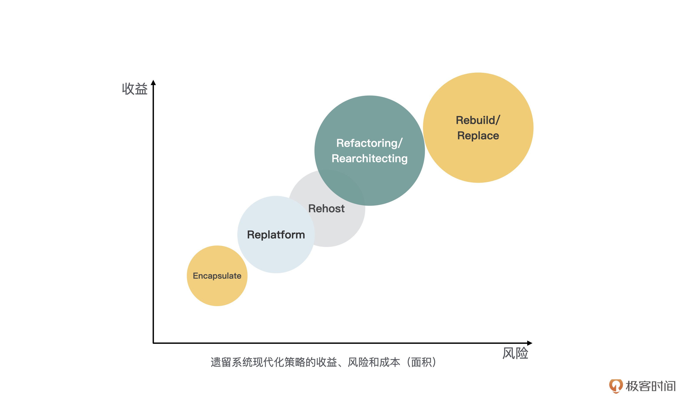

1. 遗留系统现代化的五种策略

   1. Encapsulate：**将遗留系统中的数据或者功能封装成 API，供外部调用。**

      1. 可以封装这些数据和功能，形成 API，供这些移动 App 或其他外部系统使用。
      2. 如果遗留系统本身就是基于 Web 的，可以在 Web 系统上直接构建 API；如果不是，可以选择构建一个全新的 Web API 来部署并提供服务。
      3. 好处是，以较低的成本和风险，尽可能满足外部系统的需求。你无需对遗留系统做较大的修改，只是增加一些 API 而已。遗留系统本身不会被优化，但它可以通过这些 API 对外提供能力。
      4. 不建议直接连数据库，会造成更多的混乱。
      5. 更建议基于数据库构建一个 web API，来向其它系统提供你想提供的数据和功能，而不是暴露全部的数据。

   2. Replatform：**替换运行时平台**。

      1. 例如迁移至对开发更友好的平台；
      2. 编程语言升级（请注意升级策略，一般官方都会有对应的版本升级说明）；
      3. 迁移代码版本管理工具，例如从 SVN 迁移至 Git

   3. Rehost：**将应用程序或组件部署到其他基础设施中**。

      1. 例如虚拟主机、容器或者云。
      2. 可以让你在完全不修改已有系统的情况下，快速上云，体验云环境带来的弹性、安全性和高性能，并且迁移过程也能做到很平滑。
      3. 然而由于没有任何适配，也就无法充分利用云原生的优势，因此还需要对系统内部的代码和架构做进一步调整，比如将单体架构拆分为可以独立运维的微服务。

   4. Refactor/Rearchitect：**在不改变系统外部行为的前提下，对代码或架构进行调整、优化，以偿还拖欠已久的技术债务、改善非功能需求、提升系统健康度。**

      1. Refactor 主要是指代码级别的重构。

         1. 比如你可能用 Sonar 等代码扫描工具，扫描出了很多**代码坏味道、缺陷或隐患**，修复这些问题的过程就属于 Refactor。
         2. 这和我们平时说的代码重构基本上是一个意思。

      2. Rearchitect 是指架构级别的重构。它包含两层意思：

         1. 第一层比较好理解，就是指从单体架构到分布式架构的这种架构调整。
         2. 第二层是指不改变部署单元之间的关系，而是对单个或多个部署单元内部进行模块化或分层重构。

         由于这种模块化和分层也会涉及很多代码的调整，所以这种 Rearchitect 往往会和 Refactor 同时进行。

   5. Rebuild/Replace：对遗留系统进行替换。

      1. Rebuild 可能是对应用程序的某个组件或某个服务的重新设计或重写，但会保留其原有的业务范围和业务规则。
      2. Replace 是指彻底淘汰应用程序的所有组件，去构建或购买新的软件，同时会考虑添加新的业务需求或移除某些旧的业务需求。

2. 在进行重构时，要坚持**增量演进**的策略，避免激进，不要一次性修改过多内容。

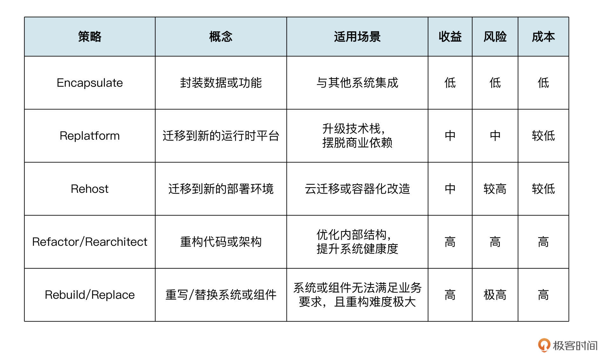

## 08 | 代码现代化：你的代码可测吗？

> 一个软件的自动化测试，可以从内部表达这个软件的质量，我们通常管它叫做内建质量（Build Quality In）。

1. 除了不能在测试中访问真实数据库以外，也不要在测试中访问其他需要部署的中间件、服务等，它们也会给测试带来极大的不便。

   1. 在测试中，我们通常把被测的元素（可能是组件、类、方法等）叫做 **SUT（System Under Test）**，把 SUT 所依赖的组件叫做 **DOC（Depended-on Component）**。
   2. 导致 SUT 无法测试的原因，通常都是 DOC 在当前的测试上下文中不可用。
   3. DOC 不可用的原因通常有三种：
      1. 不能访问。比如 DOC 访问了数据库或其他需要部署的中间件、服务等，而本地环境没有这些组件，也很难部署这些组件。
      2. 不是当前测试期望的返回值。即使本地能够访问这些组件，但它们却无法返回我们想要的值。比如我们想要获取 ID 为 1  的员工信息，但数据库中却并没有这条数据。
      3. 执行这些 DOC  的方法会引发不想要的副作用。比如更新数据库，会破坏已有数据，影响其他测试。另外连接数据库，还会导致测试执行时间变长，这也是一种副作用。

2. 如何让代码变得可测？其实很简单，就是要让 DOC 的行为可变。

   这种变化可以让 DOC 在测试时不再直接访问数据库或其他组件，从而变得**“可以访问”、“能返回期望的值”以及“不会产生副作用”**。

   要让 DOC 的构造和 SUT 本身分离，SUT 只需使用外部构造好的 DOC 的实例，而不用关心它的构造。

   我把这种在 SUT 中创建接缝从而使 SUT 变得可测的方式，叫做提取接缝模式。

   **通过将 DOC 提取为接口，并用其他实现类来改变默认行为。**

3. 对于存在大量分支处理情况的遗留代码，可通过**决策表**来梳理代码逻辑，分解为一个个的测试用例，据此来给遗留系统添加测试。

4. 测试的命名建议使用**实例化需求**的形式，从业务角度来命名测试，使得测试可以和代码一起演进，成为活文档。

5. 测试需要分组。最好的方法是，将单个类的测试都放在同一个包中，将不同方法的测试放在单独的测试类里。

   1. 而对于同一个方法，要先写它 Happy path 的测试，再写 Sad  path。
   2. 记住一个口诀：**先简单，再复杂；先正常，再异常**。
   3. 也就是**测试的场景要先从简单的开始，逐步递进到复杂的情况**；
   4. 而测试的用例要先写正常的  Case，再逐步递进到异常的 Case。

#### 一些思考：

1. 回归到现有项目，可以先按大的对象进行划分；
2. 然后制定其**主动行为接口**，根据接口来设计测试（包括期望返回）；
3. 先让基本测试不通过，随后**编写可通过的测试的实现**；
4. 再进入重构（此时代码可能会存在重复、意义不明、未考虑的其他条件、数据越界、未捕获异常、因为新需求而添加了更多的方法参数等问题），每次修改代码后都需要执行测试，确保功能的正确性；
5. 在**红/绿/重构**循环中，可能会挖掘出更细致、粒度更小的情况，依旧是先根据该用例编写测试，再去实现。

## 09 | 代码现代化：如何将一个300行的方法重构为3行？

> 基于《重构》一书中提到的“坏味道”进行重构。

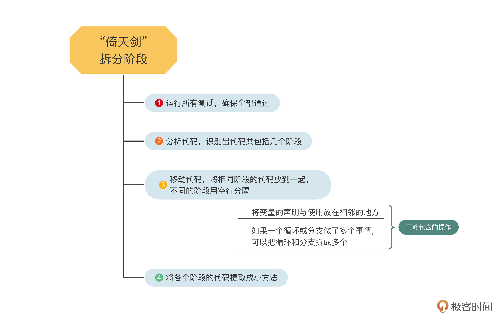

1. 拆分阶段：把方法到底做了几件事情给拎清楚，把相关的代码组织到一起。
   1. 比如，大多数情况下，一个方法都在处理这样的三个阶段：
   2. 第一，校验、转换传入的数据；
   3. 第二，根据传入或转换后的数据，完成业务处理；
   4. 第三，准备要返回的数据并返回。其中第二个阶段如果过于复杂，还可以拆分成更多的小步骤。
   5. `如果不同的变化方向形成了先后顺序，就用拆分阶段手法将它们分开。`
   6. 局部变量：在使用之前再声明——勿要一股脑全部在开头声明。
2. 方法对象：方法对象（Method Object）是极限编程和 TDD 之父 Kent Beck 在《实现模式》中提出的一种模式。
   1. 所谓方法对象，就是指只包含一个方法的对象，这个方法就是该对象主要的业务逻辑。
   2. 如果你不知道如何隔离不同的职责，就可以“无脑”地使用方法对象模式，将不同职责都提取到不同的方法对象中。
3. 大量依赖外部数据，而不依赖自己内部数据的坏味道，叫做依恋情结（Feature Envy）。
   1. 可以将这个坏味道，直接移入被依赖的外部数据中（如果可以的话），不断地消除依赖
4. 重构到设计模式固然美好，但并不一定就是最终目标，有时候你可能会用错设计模式，有时候会过度设计。`重构到一个刚刚好的状态，没有明显的坏味道，就足够了。`

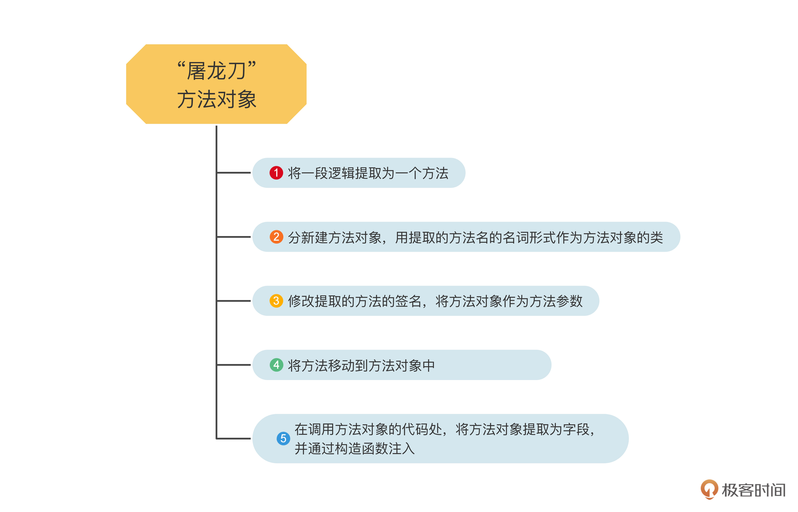

## 10 | 代码现代化 ：代码的分层重构

> 主要讲了**领域模型**。推荐书籍：《企业应用架构模式》。

1. 遗留系统中常见的模式
   1. Smart UI 模式：直来直去，好理解，但归根结底还是“面向过程式”的写法。
   2. 事务脚本（Transaction Script）模式：该模式分离了用户界面和业务逻辑，但仍然还是按数据的方式去组织业务，没有建立对象模型。
   3. MVC 模式：将界面逻辑、业务逻辑和数据库访问分离开来，形成了 UI、Service、Dao 这样的三层结构。
      1. 仍然是过程式的，和事务脚本相比，并没有本质区别。
      2. 它虽然在 Service 层向 Dao 层传递数据时使用了对象，但这种不含任何行为的贫血模型也只是起了数据传递的作用。
      3. 这种模式最大的问题在于，当逻辑变得复杂时，服务层的代码会变得越来越臃肿，不同的服务之间也很难相互调用和复用逻辑，每一个服务类都将变成上帝类（God Class）。
2. **领域模型：用对象为要解决的问题建立模型（Domain Model），用对象来描述问题中的不同元素。元素中所有的数据和行为都将在对象中有所体现。**
   1. 领域模型最重要的一点是，**要随着业务的变化而不断演进**。
   2. 领域模型处理的是领域状态的更改，更适合写操作。
   3. **基础设施层并不属于领域层的下层，它不是一个层，而是属于能力提供商模式，是可以依赖任何层的**。
   4. 领域模型确实可能造成 **Message Chains** （过长的消息链）问题。可以将一部分依赖隐藏在某个实体中。
   5. 难点之一：**领域模型中的字段需要与数据库中的表字段进行双向映射**。
      1. **数据映射器（Data Mapper）模式**：它分离了领域模型和数据库访问代码的细节，也封装了数据映射的细节。
         1. 另一方面，这种模式也导致表和领域对象的一一对应。
         2. 当查询的需求变得复杂时，数据映射器就显得力不从心了。
      2. **仓库（Repository）模式**：让它来负责协调领域模型和数据映射器。
         1. 提供了一个更加面向对象的方式，将领域对象和数据访问隔离开来。
         2. 还可以为各个仓库创建接口，定义在领域对象所在的包中。
         3. Repository 要么操作领域模型，要么返回领域模型。
         4. **将仓库的实现类和数据映射器定义在一起**，这样领域模型不依赖任何数据访问的组件，就显得十分整洁了。
   6. 一个案例说明领域模型中的**聚合根**：
      1. 在使用仓库模式时，我们只从领域对象的源头操作。我们不会去对 Borrowing 创建一个 BorrowingRepository，而是将 Borrowing 放到 User 内部，然后通过  UserRepository 去获取 User，进而获取到当前 User 所有的 Borrowing。
      2. 这么做的原因是，**Borrowing  只是一个关联对象，并不是一个所谓的“源头”。**
      3. 如果用领域驱动设计中的术语来说就是，Borrowing 不是一个聚合根（Aggregate  Root）。
      4. 你也可以将这个“源头”理解为工厂模式创建出来的产品——你要去仓库中取的是一个产品（聚合根），而不是这个产品的某个零件（关联对象）。
      5. 这也是为什么在 DDD 中，**仓库只是针对聚合根的，只有聚合根才有仓库**，聚合根上的其他实体或值对象是没有仓库的。
3. 如何判断自己使用的是哪种模式？**看你要获取一个值的时候，是从对象中获取，还是直接从数据库中查询。**
   1. 比如你想查询一本书是否被借出了，你查询数据库 BOOKS 表，如果 BORROWER_ID 这个字段为空，就返回 1，那这就是事务脚本模式；
   2. 如果你用 SQL 去获取一个模型，然后在代码中判断 getBorrowerId 方法的返回值是否为空，那就是贫血模型模式；
      1. 这种处理方式把模型当做数据的载体，比单纯的事务脚本要好很多。但是所有判断逻辑都会落在客户端代码处。
   3. 如果你用 SQL 去获取一个模型，然后调用模型的 isBorrowed 方法来判断书籍是否被借出，就是领域模型模式。
      1. 这种处理方式把模型当做数据和行为的载体，把行为封装在了领域模型内部。
4. **应用服务：一个软件系统，除了业务逻辑之外，还存在一些非业务的逻辑。是因为有了应用程序，才会有的逻辑。**
   1. 比如用户认证、事务、日志记录等。
   2. 如果一个借阅快到期了就发送通知，这种对于第三方（短信通知）服务的编排，也属于这类逻辑。
   3. Martin Fowler 等人把这类逻辑叫做**应用逻辑（Application Logic）**。
   4. **服务层（Service Layer）模式**：它是一组在领域模型之上构建的应用服务（Application Service），用来处理某个业务场景相关的应用逻辑。
      1. 从某种意义上，也可以认为服务层是对领域模型的封装，可以对 UI 层提供更加友好的接口。
      2. 由于它跟业务场景一一对应，所以 Bob 大叔在整洁架构里，管它叫做**用例（Usecase）**。
   5. 注意，判断一个借阅是否有效属于业务逻辑，而在无效时发送短信则属于应用逻辑，要在应用服务中处理。
   6. 这相当于，**领域模型提供了判断借阅是否有效的能力，而如何使用这种能力，是应用逻辑来决定的，不同的场景有不同的用法。**
   7. 我们**在应用服务中，通过仓库获取领域模型，调用领域模型中的方法，然后再通过仓库更新领域模型**。
5. **`有的时候，你之所以觉得业务没那么复杂，是因为在脑子里将业务映射成了数据库表，那么写出的代码自然是事务脚本。`**
   1. 如果你不用大脑做这一层映射，而是先将业务直接反映到领域模型中，然后再用代码去实现到数据库表的映射，往往情况就会有所好转。
   2. 你应该刻意培养自己领域建模的意识，如果没有这种意识，那么绝大多数软件对你来说，都只不过是 CRUD。

> 对于一些难以说清楚的逻辑，我是这么区分的（不一定正确，但你可以参考）：
>
> - 对于传统行业来说，将原来的手动流程变为信息化流程的，都属于业务逻辑；
>
> - 而由信息化带来的增值服务（比如自动发短信通知），就属于应用逻辑，也就是软件系统给我们带来的那些逻辑。
>
> - 如果事件发送给另一个上下文，我认为发送事件是属于应用逻辑。但也有不少人认为这是领域层的某些业务触发的领域事件，是领域逻辑。

## 11 | 架构现代化 ：在气泡上下文中打造你的新城区

> “建设新城区”的一些常用模式：
>
> - 绞杀植物模式（Strangler Fig）：一种用新系统替换旧系统的模式。
> - 气泡上下文（Bubble Context）模式：用防腐层（Anticorruption Layer）隔离开的一个小的限界上下文，这个上下文用于特殊的开发目的，并且不打算长期使用。
> - 自治气泡（Autonomous Bubble）模式：不再直接访问遗留系统的数据和服务，而是通过同步防腐层（Synchronizing ACL），将遗留系统中的数据同步到自治气泡中。

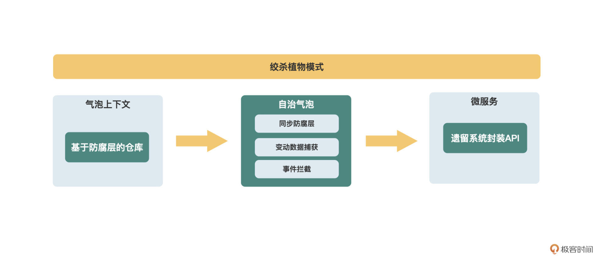

1. **绞杀植物模式**：新旧共存、并行运行、小步快跑、逐步替换。
   1. 有三个优势：
      1. 第一，不会遗漏原有需求；
      2. 第二，可以稳定地提供价值，频繁地交付版本，更好地监控其改造进展；
      3. 第三，避免“闭门造车”。
   2. 劣势：绞杀的时间跨度会很大，存在一定风险，而且还会产生一定的迭代成本。
2. 气泡上下文：明晰**防腐层**的概念。
   1. 适配器模式也是一种防腐层，用来隔离其他数据/服务的**污染**。
3. **自治气泡**：同步的方式可以是轻量级的每日同步脚本，也可以是**消息或领域事件**。
   1. 同步数据可以使用*定期脚本*或者*领域事件*；还可以使用**变动数据捕获（Change Data Capture）模式**，简称 CDC。
   2. 更好的方式还是应该**让服务来发布领域事件（Domain Event）到事件总线中**，其他服务来消费领域事件，而不是变动的数据。
   3. 如果你的遗留系统是一个 Web 系统，可以方便地添加 API，最简洁的方式是将遗留系统封装为若干个 API，对外提供业务能力，供各个气泡上下文访问。
   4. 在封装 API 时，强烈建议你**新写  API，不要复用那些老的 API**。
   5. 一方面老 API  是为特定的页面而编写的，很难被其他气泡复用。
   6. 另一方面，即使能复用，老页面与气泡的需求变化方向和速率也是不同的，很可能出现为了满足老页面的需求变化而改了 API，结果气泡上下文中的功能被破坏了。
   7. 有很多新需求都可以通过气泡上下文来构建，比如报表、问卷、评分等。

## 12 | 架构现代化 ：微服务，你准备好了吗？

> 单体有单体的好处，微服务也有微服务的好处。同时，选择了任何一种，也都要面对它所带来的问题。
>
> 单纯从纯技术角度说哪个好，是没有意义的。
>
> 同样是微服务，有些团队如虎添翼，有些团队却步履蹒跚。
>
> **这一切的背后并不是技术本身在搞怪，而是人，是团队的认知负载**。
>
> 也就是说，我们的判断依据不应该是技术本身，而应该是团队的认知负载。**哪一种方案对当前团队来说认知负载低，哪一种就更有可能成功。**

1. 基于组件的单体架构：要想改善大泥球架构，最重要的就是把业务模块之间的耦合解开，消除掉模块间的相互依赖关系。
   1. 要**将数据的所有权分开**，让不同的模块拥有不同的数据。
   2. 案例：在基于组件的单体架构中，我们要让库存模块提供一个外部模块可以访问的接口（非 Web API），销售模块**通过防腐层**去调用这个接口，转换成销售业务所需要的库存数据。
   3. 这种模块之间虽然也有依赖，但比起销售模块依赖库存模块的库存对象来说，还是要好出不少的。它通过防腐层对不同模块进行了隔离，一个模块中模型的修改，不会影响到另一个模块。
   4. 当各个模块及其数据库的弹性边界都不同时，就拆分出了微服务架构。
2. 基于微服务的架构：业务边界变得十分清晰，每个服务可以独立部署和演进，并且可以选择不同的技术栈。
   1. 一个团队只负责一个或少量的服务（业务模块），可以更好地守护住这个服务不被外界腐化。
   2. 同时由于关注点比较聚焦，认知负载也得到了降低。
   3. ⚠️多语言开发是指让不同的语言去处理各自擅长的领域，比如用 Python 去处理算法，用 Scala 去处理数据。但如果没有特殊需求，只是凭喜好来混合使用多种技术栈，那简直就是多此一举。
3. 基于组件的分解：适合将单体架构迁移到基于服务的分布式架构上，这往往是我们迈向微服务架构的第一步。
4. **实体服务（Entity Service）：一种典型的反模式**。
   1. 很多架构师在设计服务的时候，不是按业务划分，而是按比较复杂的实体对象来划分（**分布式单体（Distributed Monolith）**）。
   2. 比如员工服务或商品服务，就只包含员工或商品的增删查改。
   3. 这样会导致：一个常见的业务需求，都可能会涉及多个实体服务的修改，这就导致服务无法独立部署，只能多个服务或整体一起部署。
5. 通知、推送、告警这些类似“基础设施能力”的服务，从各个业务中剥离出来。在公共代码库中放一个接口提供调用。

## 13 | 架构现代化 ：如何改造老城区前端？

> 本章节主要讲解了如何一步步对老旧前端代码（尤其前后端代码糅合在一起）进行改造。

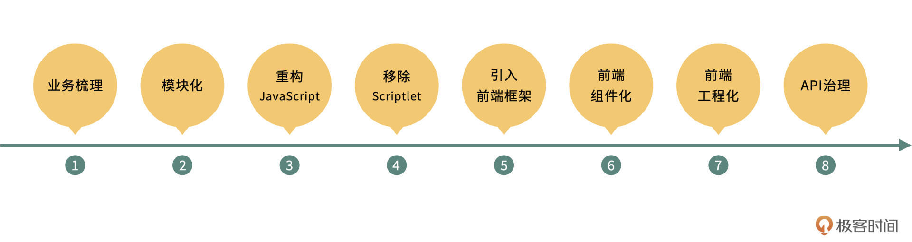

1. 梳理业务：要重构前端代码，你也得先梳理它的业务含义，搞清楚它到底做了哪些事情。
2. 模块化：指把冗长的大文件，按功能/需求等划分为不同模块，分解页面。
3. 重构 JavaScript 代码：可以按职责来将长函数分解为若干个小的函数，每个函数只做一件事情。这有点类似于代码重构中的拆分阶段，只不过拆分出来的是不同的职责，而不是一个职责的不同阶段。
4. 移除后端代码：将后端代码迁移为一个后端接口，彻底替换原先的后端代码，成为纯粹的 HTML/JavaScript。
5. 引入前端框架：基于小步稳进的策略，这里可以暂时仅使用 script 脚本引入前端框架。
6. 前端组件化：将前面的模块利用框架进行组件化。
7. 前端工程化：将组件化的部分，引入 CLI 等工具进行管理。
8. API 治理：将 Ajax 调用 API，改为 REST API，并对后端进行分层。

前端代码的重构是个浩大的工程，持续的时间会很长。因此我通常不建议直接重构遗留系统的所有前端代码，而是以后端的微服务拆分为契机，拆分出来哪些模块，就重构哪些模块的前端。这样重构的范围会更小，拆分出来的服务从前到后也都是现代化的。

可以使用[微前端](https://martinfowler.com/articles/micro-frontends.html)（Micro frontend）技术来对新老前端代码进行集成。参考微前端框架：[Mooa](https://github.com/phodal/mooa)，以及一个[微前端解决方案](https://github.com/phodal/microfrontends)。

微服务是把庞大的单体应用分解成小的、认知负载低的服务，从而将“大事化小，小事化了”。微前端也是同样的思路，它将一个单体的前端应用拆分为多个小型的前端应用，并通过某种方式聚合到一起。各个前端应用可以独立运行、开发和部署。

## 14 | 架构现代化 ：如何改造老城区后端？

> 本章主要讲了改造后端代码的几种模式以及对应的使用场景。

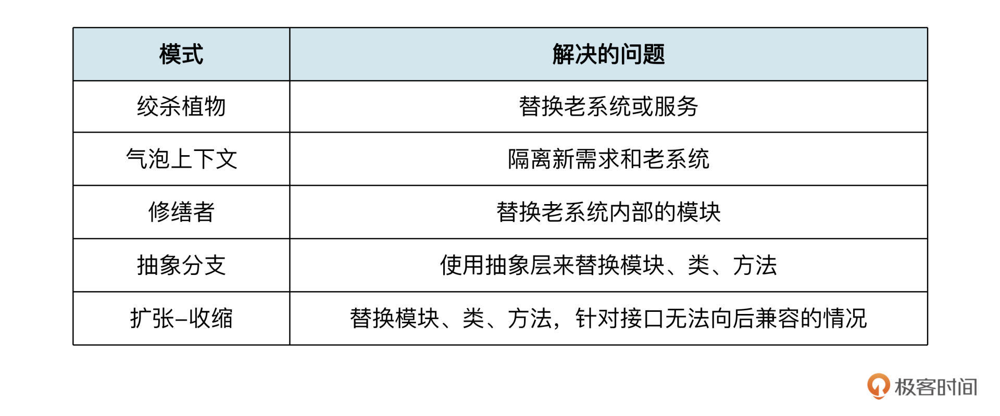

1. 修缮者模式：通过**开关隔离**旧系统中待修缮的部分，并采用新的方式修改。
   1. 在修缮过程中，模块仍能通过开关对外提供完整功能，并且保留回退余地。
2. 抽象分支：把要重构的方法，重构成一个**方法对象**，然后提取一个接口。
   1. 待重构的方法就是接口的一个实现，重构后的方法是另一个实现。
   2. 在调用端，只需通过**工厂模式**，来根据开关得到不同的实现。其余代码都保持不变；
   3. 在通过A/B测试后，删除旧的实现和开关。
   4. 优点：1、可以进行安全的重构；2、可以使用新的实现替换旧的实现，完成功能/技术的升级。
   5. 案例：使用 Kafka 替换 RebbitMQ：
      1. 先为旧实现创建一个**抽象层**，让旧的模块去实现这个抽象层（这里的抽象层不一定是接口，有可能是一系列接口或抽象类）；
      2. 然后让**部分调用端**代码依赖这个抽象层，而不是旧的模块——即逐步进行替换，而非一次性全部替换；
      3. 等全部调用端都依赖抽象层后，才开始编写新的实现，并让**部分模块**使用新的实现——逐步演进。

## 15 | 架构现代化：如何拆分数据？

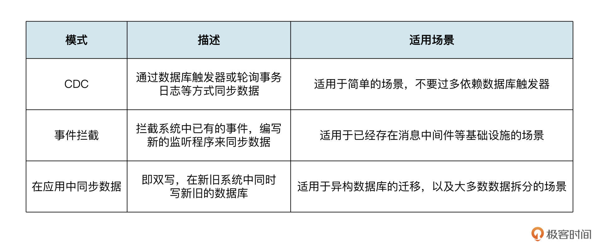

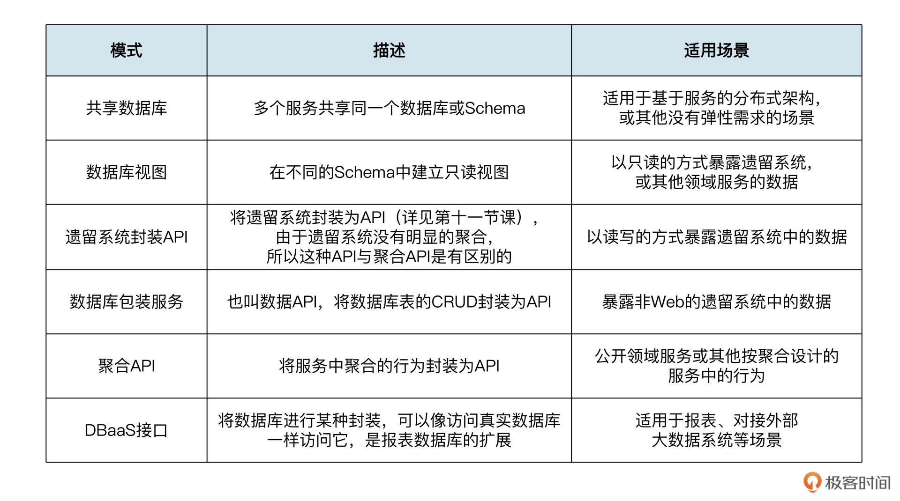

1. **共享数据库**：不同的服务访问同一数据库的不同 Schema。
   1. 不同业务领域的数据在逻辑上是隔离的，**数据的所有权**非常清晰。
   2. 一个服务如果想访问其他服务的数据，在发现 Schema 不同后，一般不会跨 Schema 去读表，而是**通过代码依赖或者数据库视图来访问**。
   3. 可以采取**数据库视图（Database View）**来向外部提供**只读**的访问权限，避免数据所有权的模糊。
2. 报表数据库（Reporting Database）模式：为报表这类只读的服务单独构建一个数据库。
   1. 这个数据库可以是业务数据库的远程复本，也可以是一个完全不同的、更适合报表的数据结构（如大宽表），并通过某种方式来做数据的转换和映射。
   2. 有时也叫做**数据库即服务接口（Database-as-a-Service Interface）**。
   3. 随着大数据的兴起，很多数据项目也使用类似的方式，将业务数据映射到数据仓库或数据湖中，再由数据流水线去进行处理。
3. 变更数据所有权（Change Data Ownership）：将混杂在一起的数据拆分出来，各自归属各自服务的过程。
   1. 可以将整个 Schema 复制一份，在新的 Schema 中删除相应的领域服务没有访问到的表，剩下的就是与领域服务有关的所有表了。
   2. 接下来，我们再对访问的表做个分组处理。需要依据的原则是，**谁写数据谁就拥有这张表**。

看到**变更数据所有权**，突然就对“**尽可能少创建表**”没有了执念。现在的设计总是数据之间各种关联交叉，数据所有权不明晰，代码中常常要做各种判断，字段过多也导致难以理解。

以后可以尝试以业务划分建模，模型下各自的实体有不同的数据，即便其数据大部分都相同，也应该分开存放，避免数据污染。

对于一些聚合类型的查询，可以做一个类似“收集器”的东西，然后进行联表或者冗余或者使用 [Elasticsearch](https://www.elastic.co/cn/elasticsearch/) 这类工具来处理查询。

至于数据库的分库分表、分布式等内容，就是以后需要了解的事情。现在的业务尚未复杂到需要使用这些技术的时候。

## 16｜DevOps现代化： 从持续构建到持续集成

> 本章节主要讲了持续构建的推荐流程。

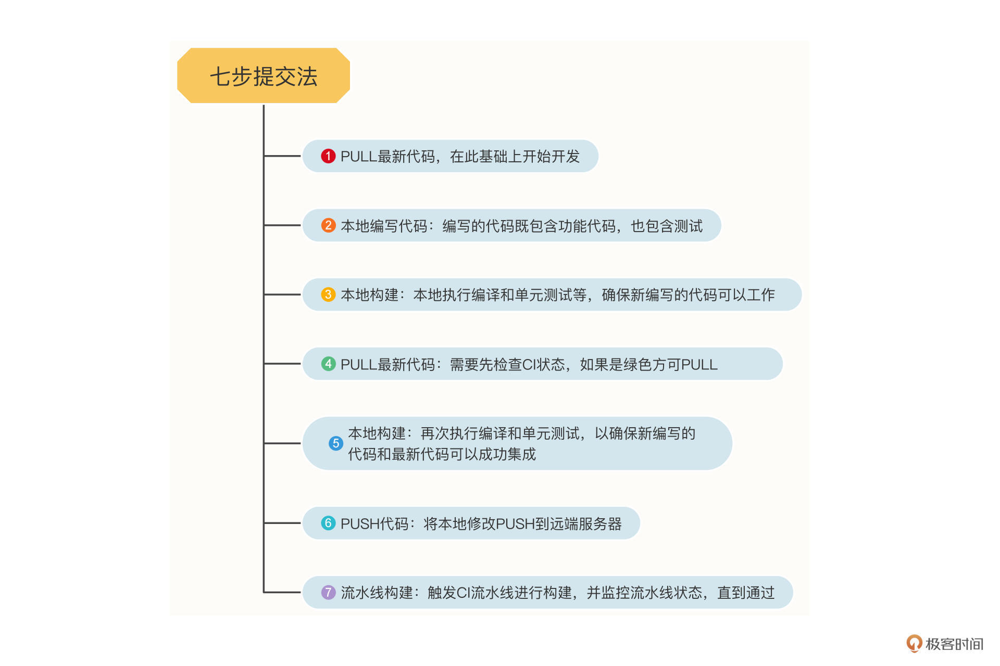

1. 持续构建：每次代码提交都会触发一次构建工作，并执行一些相关任务。这个过程由持续集成工具自动化完成。
   1. 开发人员将代码提交（PUSH）到远程代码仓库；
   2. 持续集成服务器按一定时间间隔（比如 1 分钟）轮询代码仓库，以便及时发现代码变更；
   3. 如果发现了代码变更，持续集成服务器就将代码拉取（PULL）到自己本地；
   4. 持续集成服务器按照指定的构建脚本执行各项任务，包括编译、单元测试、代码扫描、安全扫描、打包等；
   5. 任务执行完毕后，会把结果（成功或失败）反馈给开发团队。

## 17 | DevOps现代化：从持续集成到持续部署

> 本章节主要讲了一下“分支策略”。

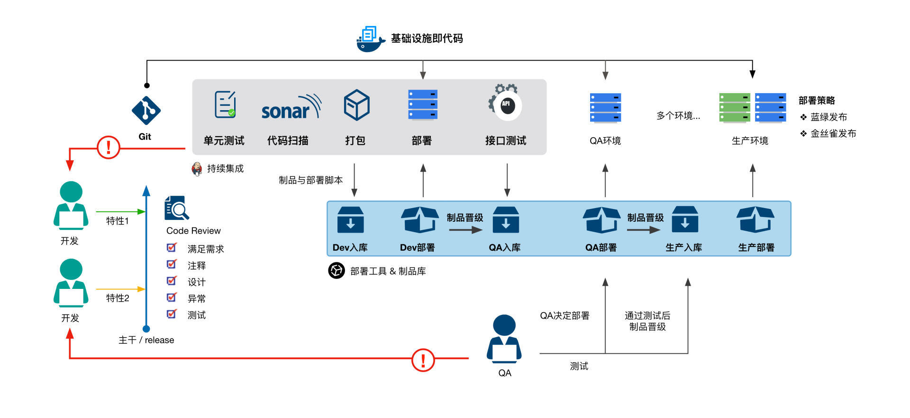

1. 特性分支所带来的问题：
   1. 首先最大的问题就是质量隐患，因为缺少制品晋级的机制，**即使所有的特性分支在各测试环境都得到了充分验证，也无法 100% 保证，所有特性分支合并到发布分支后的制品是可靠的**。
   2. 在其他测试环境所测试的制品都包含这个特性分支的代码，但发布分支中的制品却不包含，**你必须对所有特性重新测试**才能确保它们的正确性。
   3. 特性分支只有在特性开发完毕后才会合并代码，这样就无法实现小步提交和持续构建，更不要说持续集成了。
   4. 由于合并的时机比较晚，常常会**造成大规模的合并冲突**，不仅如此，在向每个环境的分支上合并时，都要解决一遍合并冲突，十分痛苦。
   5. 这种分支策略，表面上看是把不同的特性分支当成沙箱，帮助多个开发人员在隔离的环境下并行开发，但**实际上它把软件开发这个团队活动割裂为单个开发人员的单人行为**，与 DevOps 的价值观背道而驰。
2. 最理想的分支策略：**基于主干开发**
   1. 持续提交：开发人员每日持续提交当天开发的代码，持续构建和集成；
   2. 冲突处理：每次提交代码，都会先 rebase 远端的 master 代码，这让开发人员有机会在本地解决当前的冲突；
   3. 制品晋级：提交的代码经过持续集成流水线产生制品，该制品不断晋级，最终成为生产环境的部署候选。
   4. **延迟发布的特性处理**：在一开始就预警这种风险，并**使用特性开关（Feature Toggle）来进行控制**，如果需要延迟，就将开关关闭，只部署但并不交付这个特性，由于开关关闭的场景早就在多个环境下验证过了，测试人员也不需要加班。
3. 基于主干开发的策略，**当需求变化较大，多个特性开关并存且存在交叉的情况下**，会显得尤其复杂。这时候建议**对需求管理进行变革**：
   1. 一方面，**有可能不会上线的需求要提前预警**，让开发人员准备特性开关。
   2. 另一方面，**要把需求的粒度砍小**。
   3. 用细粒度的用户故事替代落后的需求文档。
4. **低风险发布**：指在部署过程中不要影响正常的业务行为，要让用户无感知；一旦部署失败，需要尽快回滚到正常状态，尽量减少对客户的影响。其包括：**蓝绿部署、滚动部署、金丝雀发布**等。
   1. **蓝绿部署（blue-green deployment）**：指准备两套完全一样的运行环境，即生产环境（蓝环境）和预生产环境（绿环境）。
      1. 在部署时，先在绿环境中部署，并测试验收。在确认没有问题后，再将请求引流到绿环境，而蓝环境则仍然保持旧版本。
      2. 当确定新版的部署没有问题后，绿环境升级为生产环境，而蓝环境则变为预生产环境，等待下次部署。
      3. 由于蓝绿部署并不会造成停机，**新的生产数据一直在产生**，这样就会给环境切换造成一定的困难。
         1. 因此，很多蓝绿部署方案都会采用**共享数据库**的方式，同时对数据迁移脚本做兼容性处理，让共享的数据库可以应对新旧两个版本的系统。
   2. **滚动部署（rolling deployment）**：在服务集群中选择一个或多个服务单元，先对这些服务单元进行部署，然后投入使用，并开始部署其他服务单元。如此循环直到所有单元都部署完毕。
   3. **金丝雀发布（Canary Release）**：**引入了用户的维度**。
      1. 比如在蓝绿部署或滚动部署中引入了新版本后，并不是将所有流量都引流到新版本，而是**只对一小部分用户开放，以快速验证，从而降低发布风险**。
      2. 在实际操作中，可以**让生产环境的测试用户作为金丝雀用户**，测试人员在生产环境进行测试和验证，这样能在一定程度上做到 QA in Production。
      3. 金丝雀发布还可以延伸成为**灰度发布**，即<u>当金丝雀用户验证通过后，不立即开发给全部用户，而是按照一定阶段逐步开放给所有用户</u>。
5. 基于主干开发策略如何在各环境中使用？
   1. 在测试环境仍旧使用**通过CI/CD的主干代码**；
   2. 生产环境则在上线前拉取一个当前版本的*发布分支*，并在下次发布之前删除这次的发布分支。

## 18 | 团队结构现代化 ：从组件团队到Spotify模型

> **按照技术或职能（functional）来划分团队或部门，无形中增加了组织壁垒，造成了不必要的沟通成本**。
>
> 因为一个围绕用户构建的需求，必然是跨越多个技术组件的。
>
> 一个本来完整的端到端的需求，因为团队按技术分组，不得不被分为前端部分、后端部分、数据库部分，一个小需求的联调和验收就要涉及到三个部门、五个不同团队的人。

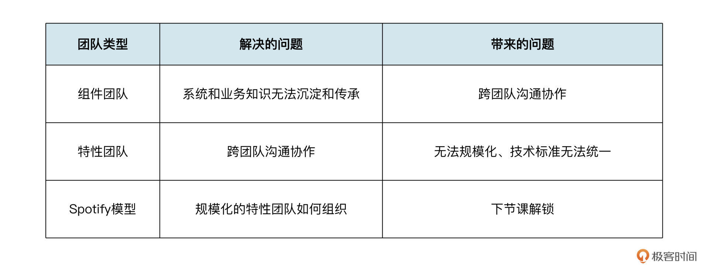

1. **组件团队（Component Team）**：即一个固定的团队负责维护一个组件，在团队内部可以形成关于该组件的知识闭环。
   1. 解决的是知识传承的问题。
2. **特性团队（Feature Team）**：指一个长期存在的、跨职能的团队，团队成员一起完成多个端到端的用户特性。
   1. 长期存在且跨职能的，因此容易形成知识沉淀，也不会出现组织壁垒。
   2. 解决的是跨团队沟通的问题。
3. **Spotify 模型**中的基本开发单元是**小队（Squad）**，它类似于特性团队，也是跨职能、自治的开发小组，由 6~12  人组成。
   1. 当小队越来越多时，负责同一个业务模块的小队就组成了一个**部落（Tribe）**，人数通常不超过邓巴数。部落首领（Tribe  Lead）负责协调各个小队以保持一致。
   2. 分会（Chapter）：由专注于不同技术的人跨小队组成，如测试分会、架构分会、前端分会等。
   3. 协会（Guild）：更像是一个兴趣小组，聚集了一些热爱分享的人，可能讨论的内容与当前工作并没有直接关系。
   4. 解决的是规模化场景下的组织问题。

## 19 | 团队结构现代化： 团队拓扑学

> 本章主要介绍了几种团队的类型，包括：业务流团队（Stream-aligned Team）、赋能团队（Enabling Team）、复杂子系统团队（Complicated-Subsystem Team）、平台团队（Platform Team）等，分别解决了不同的问题。
>
> 另外介绍了几种团队交互模式，包括：协作（Collaboration）、服务（X-as-a-Service）和促进（Facilitating）。

暂未到达这个层次，仅作了解。

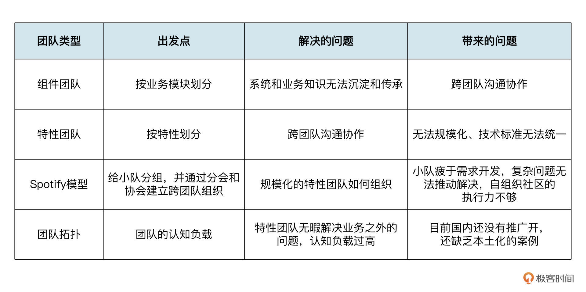

## 20｜启动：如何开启一个遗留系统现代化项目？

> 本章节以一个保险业务切入，完整地讲述了如何开启一个遗留系统的现代化。其中涉及很多知识点，只能后面重复看。

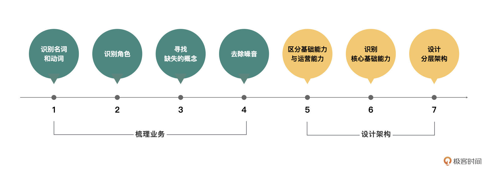

1. 业务梳理：你需要先对整体业务进行梳理，划分出业务的边界，才能进一步设计组件和服务。
   1. 你还需要沟通好业务方，请他们派出各个业务模块的领域专家跟你一起梳理。
   2. 当然，你也同样需要业务分析师、质量分析师和资深开发人员。
   3. 有很多梳理业务的方法和工具，像用户旅程、用户故事地图等，它们可以帮助你理解业务流程、梳理业务架构。
   4. 这其实也是一个降低外在认知负载、提升相关认知负载的过程。
2. 战略建模与架构设计：需要以用户旅程为蓝本，对整个系统进行战略建模，目的是设计出目标架构。
   1. 战略建模同样有很多工具可用，常见的有**事件风暴**、**动名词法**，以及刚刚兴起的**领域故事会**。
   2. **动名词建模法**是指<u>通过梳理业务需求、识别关键领域名词、识别命令动词，并将名词动词进行关联，从而形成统一语言、提取模型的建模过程</u>。
      1. <u>领域名词</u>是指在业务操作中出现的名词，通常是业务操作的对象，比如“订单”，“商品”等。 
      2. <u>命令动词</u>是指作用于领域名词的动作，使用业务语言描述（区别于 CRUD），比如“下单”，“订购”等。
   3. **建模过程主要分为 7 个步骤**：
      1. 识别动名词：在此过程中，需要与领域专家**澄清容易引起歧义的名词**，形成统一语言，避免误解。
      2. 识别角色：角色是命令动作的发起者，比如“代理人”、“承保岗”、“查勘岗”，也可以是一个系统，比如微信小程序、支付宝等。
         1. 通过识别角色，我们可以进一步了解命令动作是如何参与到业务中的。
         2. 另外，不同角色的需求和变化频率往往不同，这有助于我们设计边界更加合理的架构。
      3. 寻找缺失概念：指业务人员没有明确提到的概念，但是缺失后很可能影响业务的完整性和可追溯性。
         1. 缺失的可能是名词，比如已经识别出来了某个动词，但却没有找到与之对应的名词，你需要找到这个名词，并补充到模型中；
         2. 缺失的也可能是动词，业务人员没有明确提到，但缺失了某一动词后，名词的生命周期就不完整，这样的动词也需要补充到模型中。
         3. 要保证**生命周期的完整性**。
      4. 去除噪音：要去除或忽略无用的信息（噪音）。
         1. 在实施过程中需要有针对性地甄别，避免噪音对模型的干扰，降低后续设计过程的复杂度。
         2. 在建模时不需要关注的噪音通常包括：
            1. 无需记录的线下操作：有些行为并不会影响系统的数据或状态，因此不需要被系统记录。比如投保人提供投保单材料、上级人工核保、打印保单、清分单据等。
            2. 查询操作：和数据查询相关的操作，如数据展示、数据导出、数据过滤查询等。
            3. 字段说明：业务验证错误时的提示语、出错信息等。
      5. 区分基础能力与运营能力：借鉴 Unix 操作系统“分离策略与机制”的设计原则和 DDD 战略设计方法，我们将业务能力分为基础能力和运营能力。
         1. **基础能力**通常提供原子能力，它们不依赖于编排能力，且变化的频率很低；
         2. **运营能力**是在基础能力之上，企业想要健康运作而需要的能力，它们的变化频率很高。
      6. 识别核心基础能力：指反映业务本质，实现业务价值所必须的最小能力集合。一般遵循以下三个原则：
         1. 稳定性原则：即找出反映业务本质的部分。业务本质通常是最稳定的，而与用户的交互通常是不稳定的。
         2. 最小化原则：即尽可能做减法，非必要不做加法。
         3. 完备性原则：即核心基础能力应该是完备的，能够独立实现业务价值。
      7. 设计分层架构：**把业务名词理解为一个业务模块或组件中的核心模型，并以这些名词作为模块或组件的名称**。
3. 选择试点：在做数字化转型时，我们常常会选择一个**精益切片（Thin Slice）**作为试点，<u>而不是全盘地转型</u>。
   1. 要尽量选择既能提供一定业务价值，复杂度又不是很高的切片。
   2. 你应该快速做出一个小的增量，证明这是可行的，给团队、领导和业务方以信心。
4. `有时候你可能既想拆分微服务，又要进行代码重构，或者既要拆分数据，又想重新设计不合理的数据库，这些都是我不推荐的。你可以把它们排进计划，等一件事彻底做完再做另一件，而不要企图并行完成。因为认知负载太高了，什么都想做，最终什么也做不成。`

## 21｜微服务拆分（一）：迈出遗留系统现代化第一步

> 后面的内容均围绕“微服务”展开，这里仅作了解，后续项目如果有进展到微服务的地步，则届时再看。

1. 对于准备替换的代码部分，可以保持原样不变，不必过分考虑代码坏味道、重构等问题，因为现在的关注点是**架构接耦**。
2. 微服务拆分之初，需要搭建好的两个基础设施，一个是**基于开关的反向代理**，另一个是**数据同步机制**。

## 22｜微服务拆分（二）：三招搞定数据库表解耦

> 本章节详细讲述了**对数据库表的接耦**，主要有三种行之有效的方式。
>
> 
>
> 后面的内容均围绕“微服务”展开，这里仅作了解，后续项目如果有进展到微服务的地步，则届时再看。

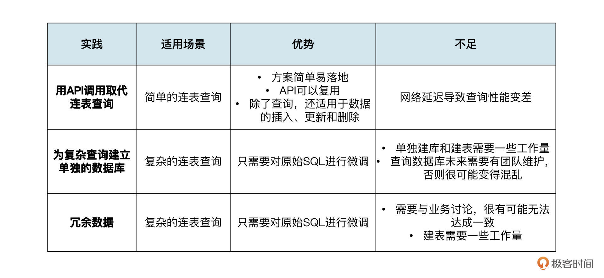

1. **用 API 调用取代联表查询**：在大多数遗留系统中，模块对于数据的所有权边界往往是很模糊的，真实情况往往是：使用一个连表查询，一次性查出所有想要的数据。
   1. 用 API 调用取代连表查询：先是调自己（查自己）、然后调服务（查别人），最后组装数据。
   2. 该方法适用于简单的联表查询。
2. **为复杂查询建立单独的数据库**：对复杂 SQL 也用 API 调用来替换，会导致成本和风险相当高，而且有些甚至是做不到的。
   1. 比如有些查询会把分页逻辑也写在 SQL 语句里，但如果 WHERE  条件中包含单体服务中的表，把这个依赖转换成 API 查询，然后在内存中再去过滤，分页就会乱掉。
   2. 可以针对这样的查询，**提取一个单独的查询数据库**出来——注意，这里的数据库是**只读**的。
   3. 这样在一定程度上还实现了读写分离。
   4. 在未来剥离单体服务中对于该表的依赖时，也可以让单体服务访问查询数据库。以后再从单体中继续剥离其他服务时，也同样可以复用这个库，可谓一举多得。
   5. 这其实就是报表数据库模式。
3. **冗余数据**：除了单独的查询数据库，还有一种方式是将复杂查询所用到的数据，都冗余到新库中。
   1. 这样，复杂 SQL 仍然不需要做修改，改造的成本也非常低。
   2. 应该**先把这些表和字段分类，对不同的类别采取不同的处理策略**。
   3. **第一种类型是快照数据**。<u>快照数据是指那些只关心数据当时的状态，而不关心数据后续变化的场景。</u>
      1. 我们可以把这类数据存储（或缓存）在消费端，一方面需要这些数据的时候就不需要远程获取了，提升了性能，另一方面当远程服务宕机的时候，也不至于影响消费端服务。
      2. 冗余数据可以放在主表（针对字段数量较少的情况，修改比较少），也可以冗余到新表（可能需要许多关联信息，根据需要冗余到不同的新表）。
   4. **第二种需要冗余的数据是业务数据**。<u>业务数据与快照数据不同，它的变化会影响到当前业务，因此不能按快照进行冗余。</u>
      1. 也就是需要同步更新的数据。
   5. **第三种需要冗余的数据是参考数据，即  Reference Data。**<u>参考数据是指那些对其他数据进行分类的数据，如国家的名称和缩写（如 CHN、USA 等）、机场的三字码（如  PEK、DAX 等）、货币代码（如 CNY、USD 等）。</u>
      1. 这些数据都是静态不变，或变化很慢的数据，因此也有人称之为静态数据。
      2. 如果由于某种原因导致参考数据发生了变化，直接在两个库或配置文件中都进行修改就可以了，毕竟这种情况发生的概率很低，没有必要在它们之间建立同步机制。
      3. 更理想的方式是将参考数据加载到缓存中，供多个服务使用，这样就没有必要冗余了。

## 23｜微服务拆分（三）：如何拆分存储过程？

> 后面的内容均围绕“微服务”展开，这里仅作了解，后续项目如果有进展到微服务的地步，则届时再看。

1. 分布式事务的解决方案会给整体拆分过程带来极大的认知负载，不到万不得已，不建议采用。
2. **将代码依赖或数据依赖改为 API 依赖，是我们进行服务拆分的最基本手段。**
   1. **使用 批量API 来代替 循环单次API**：注意批量时的大小是否超过内存负荷（例如一次性取数据库10w条数据）。
   2. **将同步 API 调用改为异步事件**：将调用 API 的地方改为抛出一个事件，发送到消息中间件上，然后在消费端消费这个事件，从而完成原本由 API 完成的工作。

## 24｜微服务拆分（四）：其他话题

> 后面的内容均围绕“微服务”展开，这里仅作了解，后续项目如果有进展到微服务的地步，则届时再看。

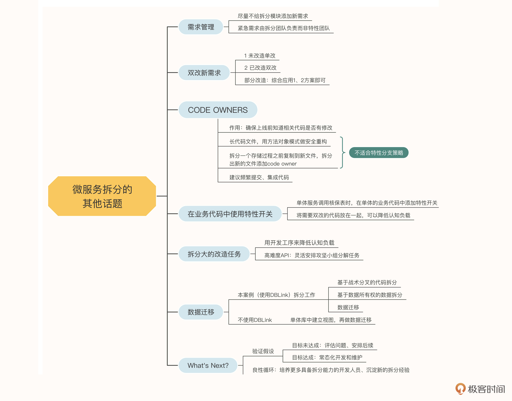

1. 在拆分初期最重要的一件事，就是要和业务方协商好，**尽量不要给拆分的模块添加新的需求**。

## 25｜成果验证：如何评价遗留系统现代化项目的成败？

不想打字了，看图吧。

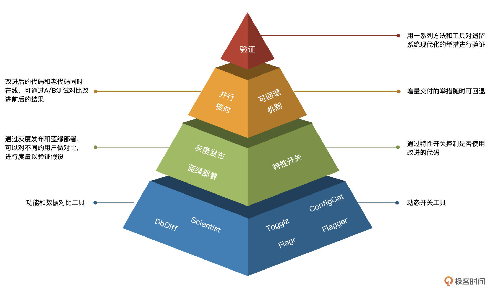

## 大咖助阵｜存储过程的拆分锦囊

> 不准备了解存储过程了。项目中也不会用到。所以这里没有笔记。

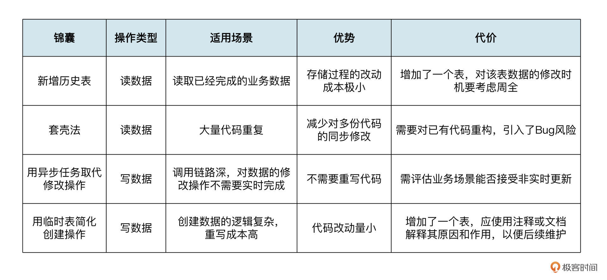

## 结束语｜技术终将老去，但好在你还年轻

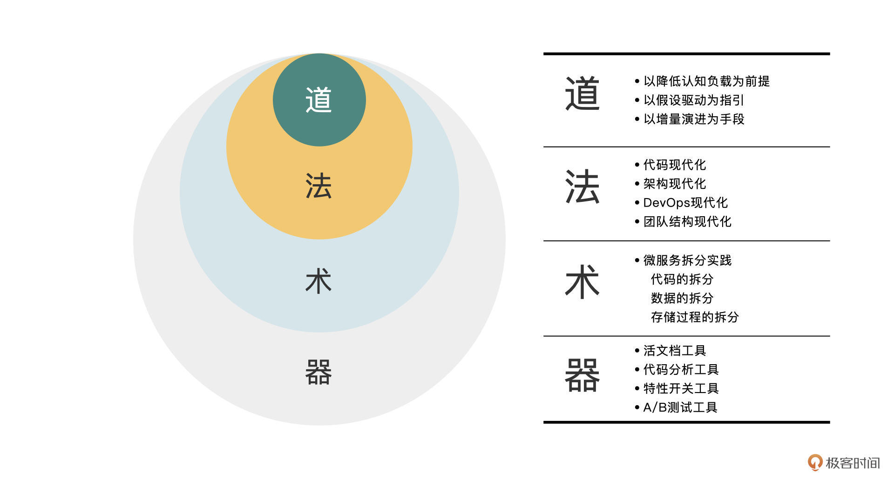
